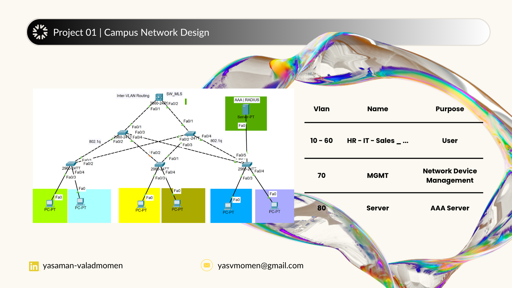
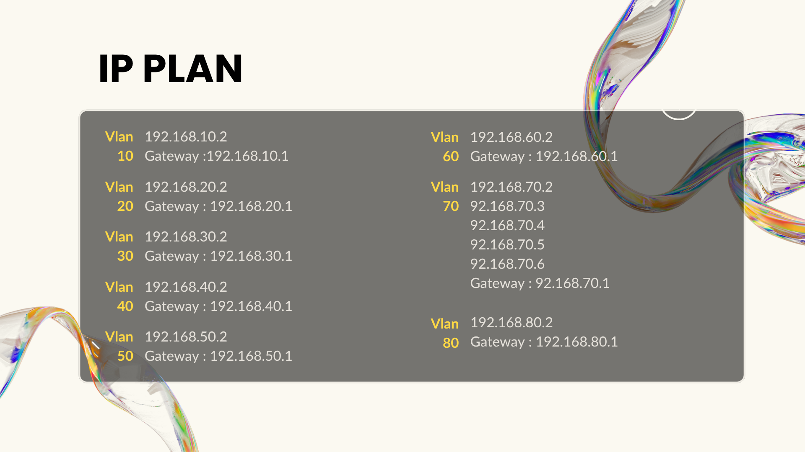
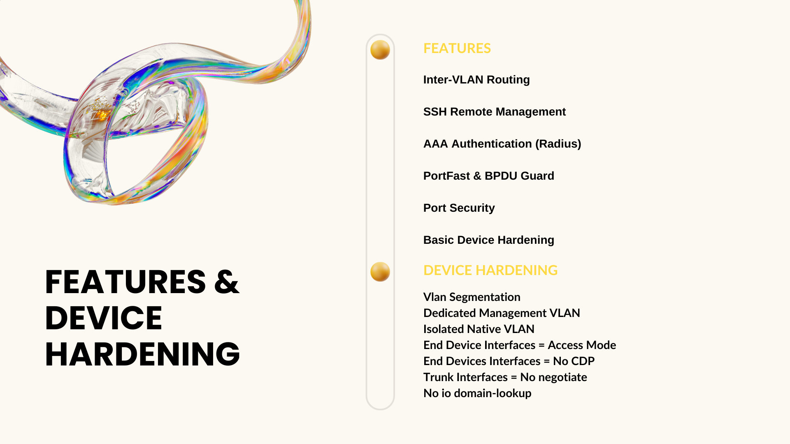
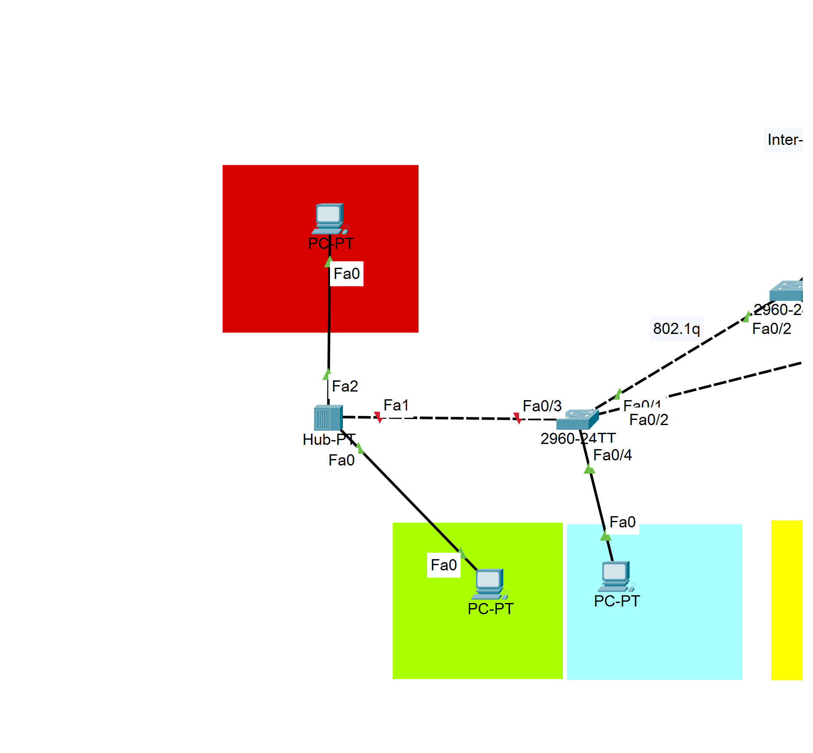
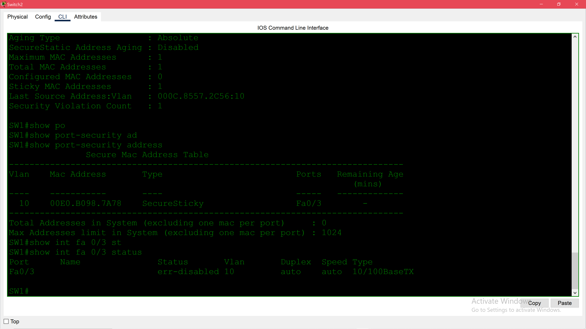
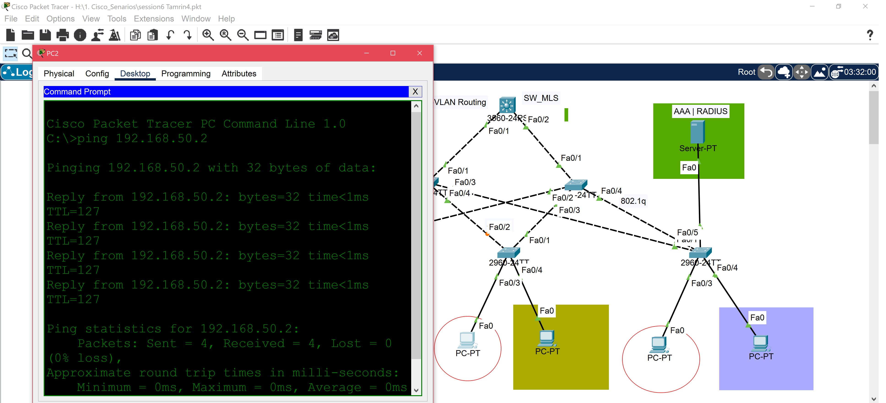
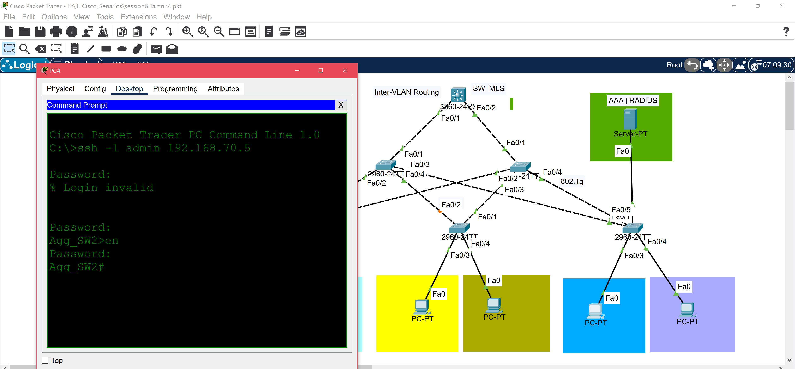

# Campus Network Design

## 📌 Overview | خلاصه
در این سناریو شبکه ای ساده طراحی شده تا از طریق تجهیز MLS امکان مسیریابی در شبکه و با استفاده از Radius Server امکان SSH به تمامی تجهیزات (با حفظ نکات Device Hardening) فراهم شود.

## 🎯 Objectives | اهدف 
- Configure VLANs
- Configure SSH remote access
- Configure AAA authentication
- Secure switch access
- Verify connectivity

## 🛠 Technologies Used
- Cisco Packet Tracer
- VLAN
- TRUNK
- SSH
- AAA (Radius Server)
- Port Security
- Port-Fast & BPDU Guard
- Management VLAN

## 🖥 Network Topology

## 🌐 IP Addressing

## 👁‍🗨 Device hardening & Features

- Port Security

در vlan 10 سیستمی با مک ادرس غیر مجاز سعی داشت به تجهیز متصل شود.

به دلیل فعال بودن port security بر روی interface های متصل به End Device ها کل ارتباط آن interface به دلیل رخ دادن Violation قطع شد.

## ⚙ Configuration

The configuration commands are available in the `Command.txt` file

## ✅ Verification

- Successful ping between VLANs

- SSH login testes

- AAA authentication verified

## 👩‍💻 Next Episode is about ETHERCHANNEL, TOPOLOGY CHANGES, DHCP SNOOPING AND ... 🎆
