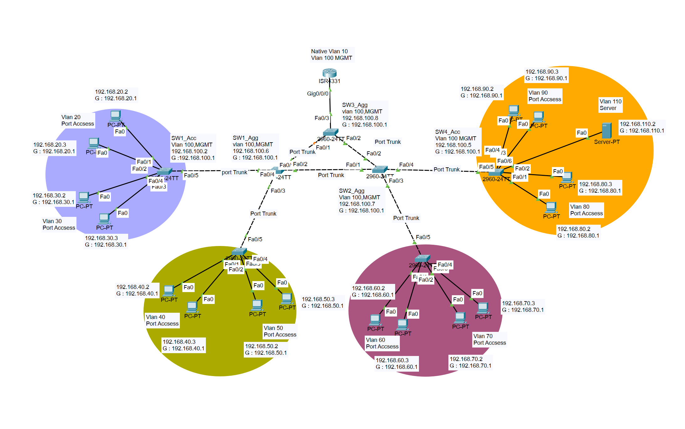
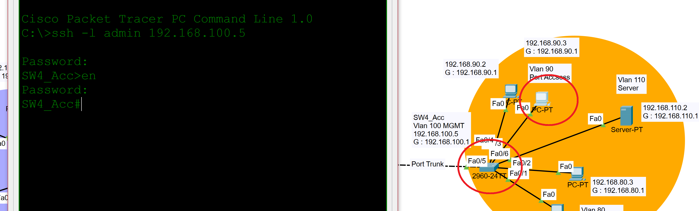
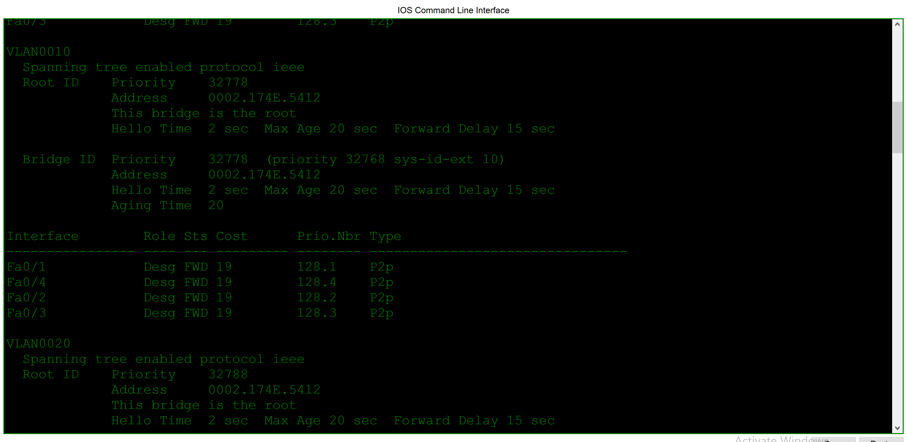
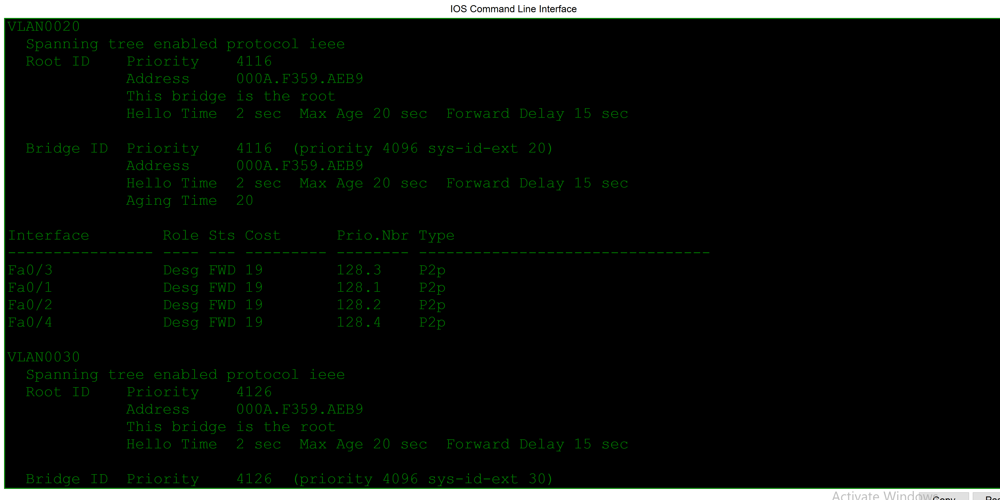
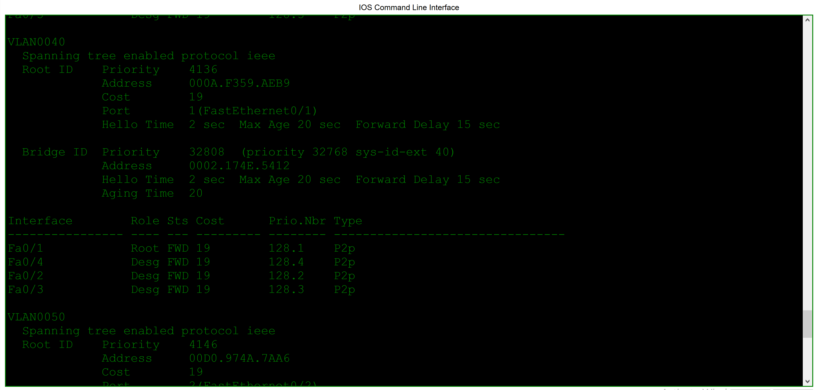

# Etherchannel | STP |...

## Overview | خلاصه

در این سناریو شبکه ای ساده طراحی شده، SSH فعالسازی شده، به ازای هر Vlan یک Topology متفاوت راه اندازی شده و نحوه انتخاب Root Bridge بررسی و مدیریت شده است.

## Objectives | اهداف
- SSH
- Write memmory
- Topology Changes
- Change RB
- Change Cost
- STP Configuration
- RSTP Configuration
- STP instance
- Etherchannel
- port Security

## Technologies Used
- Cisco Packet Tracer
- VLAN
- TRUNK
- SSH
- AAA (Radius Server)
- Port Security
- Port-Fast & BPDU Guard
- Management VLAN
- Etherchannel
- STP & RSTP

## Network Topology
 

## IP Addressing

.... 🚧🛠

## Configuration

... 🚧🛠

## Verification

- SSH login test

 - STP Configuration

 همانطور که در تصویر میبینید در لایه AGG برای اعمال فرایند Loop prevention پروتکل STP دست به کار شده و Interface fa 0/1 در SW3_Agg به حالت BLK یا ALT در آمده، این موضوع برابر است با عدم استفاده از پورتی با ظرفیت 100Mbps !!! برای رفع این مشکل از مفهومی بنام Per Vlan Spann Tree استفاده میکنیم. در سناریو زیر SW2_Agg در تمامی Vlanها یک RB است :
 
 

 با اعمال دستور مروبطه در هر Vlan اقدام به کاهش Base Priority کردیم. از دیدگاه STP شبکه در حالت زیر قرار دارد :
SW1_Agg : RB in Vlan 20,30,40
SW2_Agg : RB in Vlan 10,80,90,100,110
SW3_Agg : Rb in Vlan 50,60,70

تغییر SW1_Agg به عنوان RB در Vlan 20,30,40 :

 

تغییر SW2_Agg به عنوان non root bridge در Vlan 20,30,40,50,60,70 :

